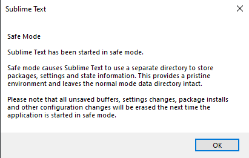

## Troubleshooting

Because Sublime Text is so customizable,
it is possible for third-party packages and/or local customization
to interfere with one another or cause other problems.
You might see this, for example,
as Python exceptions that don't make sense in the Console Panel,
or certain functionality isn't behaving as you expect.

### Safe Mode



Starting with version 4,
you can launch Sublime Text in *Safe Mode*
via the Command Line Interface:

```sh
subl --safe-mode
```

Additionally on Windows and Mac,
holding a modifier key while starting the application
will open it in Safe Mode:

* **Windows**: <Key k="shift+alt" />
* **Mac**: <Key k="option" />

When launched this way,
Sublime Text uses an alternate [Data directory][],
thus disabling all third-party packages and local customizations,
as well as not loading any previously opened sessions.
This will help you to verify whether the behavior you are observing
is or is not coming from Sublime Text itself
or one of its shipped packages.

The alternate Data directory used is:

* **Windows**: `%APPDATA%\Sublime Text (Safe Mode)\`
* **macOS**: `~/Library/Application Support/Sublime Text (Safe Mode)/`
* **Linux**: `~/.config/sublime-text-safe-mode/`

Another nice aspect about Safe Mode is
that you can perform experimental customizations
or packages you think might have caused problems
without affect Sublime Text's ability
to start and behave normally,
because:

- such packages will be installed in the alternate Data directory,
  thus not impacting normal sessions, and
- each time Sublime Text starts in Safe Mode,
  it deletes any content in the Safe Mode Data directory,
  so it "doesn't hurt" if a package installed there
  did something it wasn't supposed to.

::: warning Caution
**Do not store anything important in the Safe-Mode Data directory!**
The data will be removed latest on the next Safe Mode start.

**Do not install suspicious packages with Python plugins even in Safe Mode!**
Python plugins still have access to the full Python library
and can access your file system
as if they were running natively on your system.
:::

After attempting to reproduce the behavior you observed previously in Safe Mode,
you were either successful or not.

**Reproducible in Safe Mode**
: If the behavior is still being exhibited,
  it could be caused by a corrupted shipped Package file,
  which can be remedied by re-installing Sublime Text,
  or a bug.
  You can look for already reported bugs
  on the [official issue tracker][issue tracker]
  or report a new one
  if no existing one matches your situation.

[issue tracker]: https://github.com/sublimehq/sublime_text/issues

**Not Reproducible in Safe Mode**
: If the behavior disappears,
  then you know it was caused by something in your Data directory.
  Follow the section below to narrow down the cause further.


### Diagnosing Trouble from the Data Directory

If you have reached the conclusion
that the trouble you are experiencing has come from the Data directory
(third-party packages and/or local customization),
you can discover the source of the problem by following these steps.
Knowing *when* the problem started is also an asset,
because the cause will most likely have occurred
just before the problem started.

1. Close Sublime Text if it is running.
1. Rename the [Data directory][] to another name
   to keep it as a backup and reference about
   what packages you installed and what customizations you made.
1. Re-start Sublime Text.

When Sublime Text starts, it will create a fresh new Data directory.

::: tip Note
In subsequent steps,
it is recommended to keep
the contents of the renamed problematic Data directory unaltered
for the sake of preserving the evidence.
This is so that if your first attempt at isolating the problem isn't successful,
you can repeat it
as many times as needed
using smaller or different steps
until you have isolated the problem.
:::

#### Diagnosis by Isolating Packages

Now you can re-install third-party packages you had in place
(and were working correctly)
well before the problem started.
You can install each package individually
or multiple (related) packages in a group
to speed up the process.

Verify whether the problem is occurring after each increment.

**The problem is *not* occurring**
: Continue re-adding more packages
  until the behavior returns.

**The problem *is* occurring**
: Now you know the problem is somewhere in that group of packages,
  and you can take steps to further isolate the source
  by reverting and repeating this step
  with only half of the packages in the group.
  Keep dividing the group until you have isolated the source
  ideally to a single package.

#### Diagnosis by Isolating Customizations

If you have re-installed all third-party packages
and the problem has not returned,
now you can add your own customizations back in,
one at a time,
until the problem resurfaces.
If/When you encounter the problem again,
you will know where to investigate further to remedy,
or, as the case may be, what *not* to do.

[Data directory]: ../getting-started/basic-concepts.md#the-data-directory
