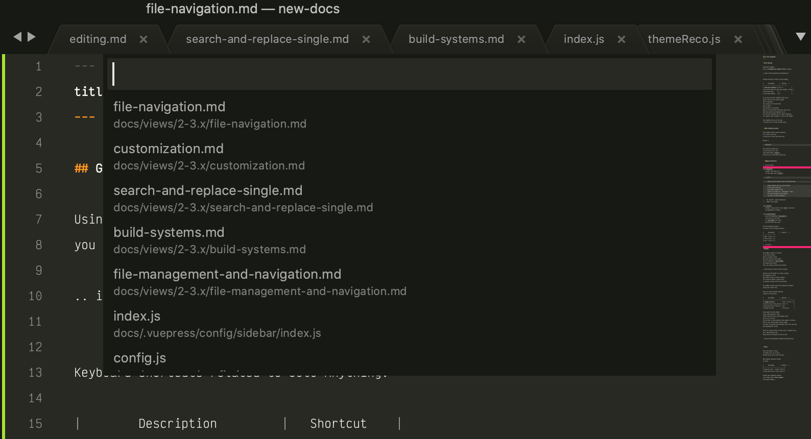

## Goto Anything

Using Goto Anything,
you can **navigate your project's files** swiftly.



Keyboard shortcuts related to Goto Anything:

| Description                              | Shortcut |
| ---------------------------------------- | -------- |
| **Open Goto Anything**                   | Ctrl + P |
| Pin current item and close Goto Anything | Enter    |
| Pin current item                         | →        |
| Close Goto Anything                      | Esc      |

As you type into Goto Anything's input area,
names of files in the current project
will be searched,
and a preview of the best match
will be shown.
This preview is *transient*;
that is, it won't become the actual active view
until you perform some operation on it.
You will find transient views in other situations,
for example, after clicking on a file in the sidebar.

Goto Anything lives up to its name –
there's more to it than locating files.


### Goto Anything Operators

Goto Anything accepts several operators.
All of them can be used
on their own or after the search term.

**Example:**

```
models:100
```

This instructs Sublime Text
to first search for a file
whose path matches ``models``,
and then to go to line 100 in said file.


#### Supported Operators

`@symbol`
: Searches  the active file
  for the symbol named ``symbol``.

  ::: tip Note
  Symbols usually include class and function names.

  Symbol searches will only yield results
  if the active file type
  has symbols defined for it.
  For more information about symbols,
  see [Symbols](/reference/symbols.md).
  :::

`#term`
: Performs a fuzzy search of the `term` search term
  and highlights all matches.

`:line_number`
: Goes to the specified `line_number`,
  or to the end of the file
  if `line_number` is larger
  that the file's line count.

The Goto Anything operators
are bound to the following shortcuts:

| Description | Shortcut |
| ----------- | -------- |
| **@**       | Ctrl + R |
| **\#**      | Ctrl + ; |
| **:**       | Ctrl + G |


## Sidebar

The sidebar provides an overview
of the active project
(more on projects later).
Files and folders in the sidebar
will be available in [Goto Anything](#goto-anything)
and project-wide actions
like, for example, project-wide searches.

<!-- TODO: maybe say "Find in Files" instead. -->

Projects and the sidebar are closely related.
It's important to note
that there's always an active project;
if you haven't opened a project file,
an anonymous project will be used instead.

The sidebar provides basic file management operations
through its context menu.

These are common keyboard shortcuts
related to the side bar:

| Description                    | Shortcut           |
| ------------------------------ | ------------------ |
| **Toggle side bar**            | Ctrl + K, Ctrl + B |
| Give the focus to the side bar | Ctrl + 0           |
| Return the focus to the view   | Esc                |
| Navigate side bar              | Arrow keys         |

Files opened from the sidebar
create *semi-transient* views.
Unlike transient views, semi-transient views
show up as a new tab.
The tab title of semi-transient views appears in italics.
Before a new semi-transient view is opened,
any other pre-existing semi-transient view in the same pane
gets automatically closed.

Here's an example showing a normal view, a transient view,
and a semi-transient view.
Notice that the transient view has no tab:


## Panes

Panes are groups of views.
In Sublime Text, you can have
multiple panes open at the same time.

Main keyboard shortcuts related
to panes:

| Description       | Shortcut       |
| ----------------- | -------------- |
| Create new pane   | Ctrl+K, Ctrl+↑ |
| Close active pane | Ctrl+K, Ctrl+↓ |

Further pane management commands
can be found under **View → Layout**
and related submenus.
