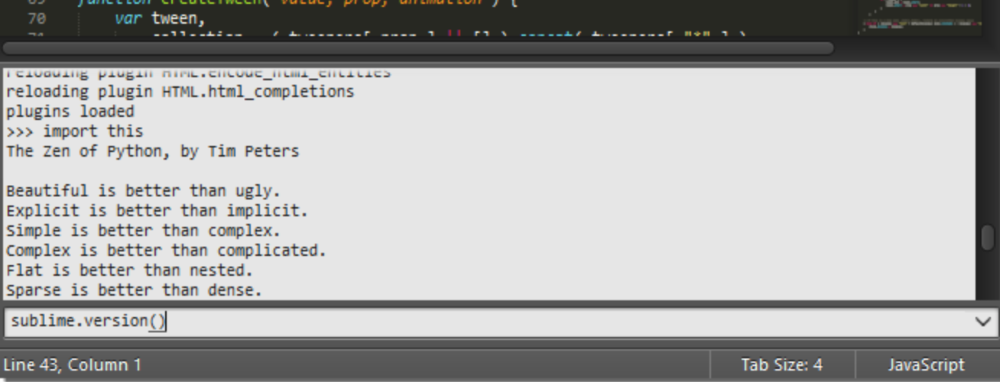

To fully understand the rest of this guide,
you need to be familiar
with the concepts presented on this page.

## General Conventions

This guide is written from the perspective of a Windows user.
Most instructions will only require trivial changes
to work on other platforms.

Unless otherwise noted,
relative paths (for example, `Packages/User`)
start at the [Data Directory](#the-data-directory).

We assume default key bindings
when indicating keyboard shortcuts.
If you are using a non-US-English keyboard layout,
some key bindings may not match your layout.
This is due to the way Sublime Text
processes key strokes internally.

## Mastering Sublime Text Takes Time

Mastering Sublime Text requires time and practice.
Luckily, it's built around
a handful of concepts
that make for a consistent
system once all the pieces come together.

This guide will teach you
how to use and configure Sublime Text.

Sublime Text is a versatile editor for programmers,
but you don't need to be one
in order to use it,
and you don't need
to configure it extensively 
to be productive –
it's an efficient tool out of the box!
Hackers, however, will appreciate
all the customization and extensibility opportunities.

In the following paragraphs,
we'll outline key aspects
that you'll get familiar with
after you've spent some time using the editor.

## The `Data` Directory

Nearly all of the interesting files for users
live under the *data directory*.
The data directory is
a platform-dependent location:

* **Windows**: `%APPDATA%\Sublime Text 3`
* **OS X**: `~/Library/Application Support/Sublime Text 3`
* **Linux**: `~/.config/sublime-text-3`

If you're using the **portable version** (Windows only),
look for `Application/Data`.
Here, `Application`
refers to the directory
to which you've extracted
the compressed portable files
and where the executable resides.

Note that the `Data` directory
only exists with that name
in the portable version.
In full installations,
it is one of the locations
indicated above.

## The *Packages* Directory

This is a key directory
located under the data directory.
All resources for supported programming
and markup languages
are stored here.

(More on *packages* and *resources* [later](../extensibility/packages.md).)

You can access the packages directory
from the main menu (**Preferences → Browse Packages...**),
by means of an API call (`sublime.packages_path()`),
and by other means
that will be explained in later topics.

In this guide, we refer to the packages folder
as *Packages*, *packages path*, *packages folder*, or *packages directory*.

### The *User* Package

`Packages/User` is a catch-all directory
for custom plugins, snippets, macros, etc.
Consider it your personal area
in the packages folder.
Additionally, it will contain
most of your personal application or plugin settings.

Updates to Sublime Text will never
overwrite the contents of `Packages/User`.

## Sublime Text is Programmable

This information is useful for programmers.
Other users just need to know
that Sublime Text
enables users with programming skills
to add their own features to the editor.

Sublime Text exposes its internals
via an Application Programming Interface (API)
that programmers can interact with using
the [Python programming language][Python].

### The Console

Sublime Text and plugins push debug information
to the *console*.
To open the console,
press <kbd>Ctrl+\`</kbd>
or select **View → Show Console**
from the main menu.

Here's the Python console in Sublime Text:

An embedded Python interpreter is included
in the editor.
The embedded interpreter is useful
to inspect the editor's settings
and to quickly test API calls
while developing plugins.

### Your System's Python vs the Sublime Text Embedded Python

Sublime Text comes with its own embedded Python interpreter
that's separate from your system's Python interpreter
(*if available*).

The embedded interpreter is only intended
to interact with the plugin API,
not for general development.

## Packages, Plugins, Resources and Other Terms

Almost every aspect of Sublime Text
can be extended or customized.
You can modify the editor's behavior,
add macros and snippets, extend menus
and much more.
You can even create whole new features
using the editor's API to build complex
plugins.

Sublime Text's vast flexibility is the reason
why you will learn
about so many configuration files:
there simply must be a place
to specify all available preferences and settings.

Configuration files in Sublime Text
are text files
that conform to a predefined structure or *format*:
JSON predominates,
but you'll find XML and YAML files, too.
For the more advanced
extensibility options,
Python source code files are used.

In this guide, for brevity,
we sometimes refer collectively to all these
disparate configuration files as *resources*.

Sublime Text will look for resources
inside the packages folder.
We'll talk at length about *packages* later,
but the short version is that,
to keep things tidy,
Sublime Text has a notion of a *package*,
that is, a folder (or zip archive)
that contains resources
that belong together.
(Maybe they help
compose emails faster,
write HTML efficiently,
enhance the coding experience for C, Ruby, Go, …).

## Textmate Compatibility

[TextMate][] is an editor for the Mac.

Since Sublime Text was heavily inspired by TextMate 1,
it supports most of the extensions provided in TextMate bundles,
notably excluding `.tmCommands` and `.tmSnippets` files
and any other configuration in `.plist` files.
While most of the older formats are recognized by Sublime Text,
e.g. `.tmLanguage` and `.tmTheme`,
new formats using `.sublime-*` extensions have been added
that provide a superset of the old functionality
or are simply replacements for TextMate's formats.

[TextMate]: https://macromates.com/

## vi/Vim Emulation

vi is an ancient modal editor
that lets the user perform all operations
from the keyboard.
Vim, a modern version of vi,
is still in widespread use.

Sublime Text provides vi emulation
through the [Vintage][] package.
The Vintage package is *ignored* by default
and needs to be enabled by the user.
Learn more about [Vintage][]
in the official documentation.

Several third-party packages have been developed
to implement to supplement or replace
the built-in vi emulation.
We will cover installation and usage of third-party packages later.

[Vintage]: https://www.sublimetext.com/docs/3/vintage.html

## emacs Emulation

emacs is another popular
editor for programmers.

Sublime Text does not offer
any built-in emacs emulation,
but you can try third-party packages
created by other Sublime Text users.
As with third-party packages for vi emulation,
we will cover installation and usage of these later.
