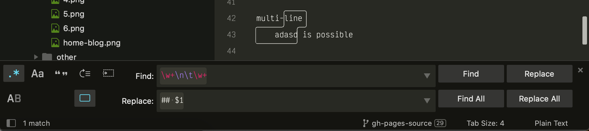

## Searching

Keyboard shortcuts related to the search panel:

|        Description         |   Shortcut    |
| -------------------------- | ------------- |
| **Open search panel**      | Ctrl + F      |
| Toggle regular expressions | Alt + R       |
| Toggle case sensitivity    | Alt + C       |
| Toggle exact match         | Alt + W       |
| Find next                  | Enter         |
| Find previous              | Shift + Enter |
| Find all                   | Alt + Enter   |

## Incremental Search

Keyboard shortcuts related to the incremental search panel:

|        Description         |   Shortcut    |
| --------------------------------- | ------------- |
| **Open incremental search panel** | Ctrl + I      |
| Toggle regular expressions        | Alt + R       |
| Toggle case sensitivity           | Alt + C       |
| Toggle exact match                | Alt + W       |
| Find next                         | Enter         |
| Find previous                     | Shift + Enter |
| Find all                          | Alt + Enter   |

The only difference between this panel
and the regular search panel
lies in the behavior of the <kbd>Enter</kbd> key.
In incremental searches,
it will select the next match in the file
and dismiss the search panel for you.
Choosing between this panel or the regular search panel
is a matter of preference.

## Replacing Text

Keyboard shortcuts related to the replace panel:

| Description            | Shortcut           |
| ---------------------- | ------------------ |
| **Open replace panel** | Ctrl + H           |
| Replace next           | Ctrl + Shift + H   |
| Replace all            | Ctrl + Alt + Enter |

## Tips

### Other Ways of Searching in Files

[Goto Anything](../file-managemant/navigation.md#goto-anything)
provides the `#` operator
to search in the filtered file.

### Other Search-Related Key Bindings

These key bindings work
when the search panel is hidden:

| Description                                  | Shortcut   |
| -------------------------------------------- | ---------- |
| Search forward using most recent pattern     | F3         |
| Search backwards using most recent pattern   | Shift + F3 |
| Select all matches using most recent pattern | Alt + F3   |

You can also perform searches
based on the current selection:

| Description                     | Shortcut         |
| ------------------------------- | ---------------- |
| Search using current selection  | Ctrl + E         |
| Replace using current selection | Ctrl + Shift + E |

### Multiline Search

You can type in multiline search patterns
into search panels.
To enter newline characters,
press <kbd>Ctrl + Enter</kbd>.

Note that search panels are resizable too.
